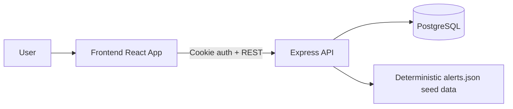

# SOC Alerts Dashboard

Full-stack SOC triage application built with React + Vite (frontend) and Express + PostgreSQL (backend), with cookie-based JWT authentication.

## What This Includes

- Login/logout with protected routes and protected API access
- Dashboard aggregates by severity/category/status with click-through filtering
- Alerts list with filtering, sorting, and pagination
- Alert detail editing (status, severity, assignee) with dismiss shortcuts
- Saved filter presets in the alerts list (stored in localStorage)
- Bulk actions in the alerts list (batch updates using existing PATCH API)
- Automated tests (frontend utility tests + backend API health test)

## Tech Stack

- Frontend: React 18, Vite, React Router, Tailwind CSS
- Backend: Node.js, Express, PostgreSQL (`pg`)
- Auth: JWT in httpOnly cookie
- Data seeding: deterministic JSON dataset + seed script

## Project Structure

```text
backend/
	src/
		app.js
		index.js
		db.js
		auth.js
		routes/
			auth.js
			alerts.js
	data/
		alerts.json
	scripts/
		seedData.js
		generateAlertsJson.js
	test/
		health.test.js

frontend/
	src/
		api.js
		pages/
			AlertsListPage.jsx
			AlertDetailPage.jsx
			DashboardPage.jsx
			LoginPage.jsx
		utils/
			alertsFilters.js
			__tests__/
				alertsFilters.test.js
```

## Environment Variables

### Backend

Set one of the following for DB connection:

- `DATABASE_URL`
- `EXTERNAL_DATABASE_URL`
- `INTERNAL_DATABASE_URL`

Also supported:

- `PORT` (default: `5000`)
- `FRONTEND_URL` (for CORS)
- `JWT_SECRET`

### Frontend

- `VITE_API_URL` (optional; defaults to `/api`)

## Local Run (Recommended)

### 1. Start backend

```bash
cd backend
npm install
npm run seed
npm run dev
```

### 2. Start frontend

```bash
cd frontend
npm install
npm run dev
```

### 3. Access app

- URL: `http://localhost:3000`
- Seeded analyst account:
	- Email: `analyst@company.com`
	- Password: `Alert123!`

## Docker Compose Run

1. Create root `.env` from `.env.example`
2. Set `EXTERNAL_DATABASE_URL`
3. Run:

```bash
docker compose up --build
```

## Data Seeding

- `backend/data/alerts.json` contains deterministic seed data (~1000 records)
- Seed command:

```bash
cd backend
npm run seed
```

- Regenerate deterministic JSON (if needed):

```bash
cd backend
npm run generate:data
```

## New Flows Added

### Saved Filter Presets

In alerts list:

1. Set filters/search/sort/range
2. Enter preset name
3. Click `Save preset`
4. Use dropdown to `Apply` or `Delete`

Saved fields include severity, status, category, range, custom start/end, query, sort field, and sort order.

### Bulk Actions

In alerts list:

1. Select rows using checkboxes (or select all visible)
2. Apply bulk updates:
	 - Mark investigating
	 - Mark resolved
	 - Mark false positive
	 - Set severity high

Bulk updates call `PATCH /api/alerts/:id` for each selected alert and refresh the list.

## API Summary

All protected routes are under `/api`.

### Auth

- `POST /api/auth/login`
- `POST /api/auth/logout`
- `GET /api/auth/me`

### Alerts

- `GET /api/alerts`
- `GET /api/alerts/:id`
- `PATCH /api/alerts/:id`
- `GET /api/alerts/stats/dashboard`

### Query Params (`GET /api/alerts`)

- `page`, `limit`
- `severity`, `status`, `category`
- `q` (search)
- `sortBy`, `sortOrder`
- `startDate`, `endDate`

## Automated Tests

### Backend tests

```bash
cd backend
npm test
```

Current coverage:

- `GET /api/health` returns `{ status: 'ok' }`

### Frontend tests

```bash
cd frontend
npm test
```

Current coverage:

- `deriveRangeDates` utility behavior for all/custom/rolling ranges
- `alertsListTools` preset and bulk-selection helpers

## Build

```bash
cd frontend
npm run build
```

## Approach Summary

The implementation deliberately favors a production-like shape:

- No local SQLite file in the final runtime path.
- No random seed generation at startup.
- No hidden test-only mocks in the production routes.
- A deterministic JSON data file makes the seed process transparent and reproducible.
- Docker support remains available for local full-stack runs, but Render deployment can use the native build/start commands above.

## Architecture

The app uses a simple three-tier flow:

1. React frontend handles navigation, filters, presets, and bulk selection.
2. Express backend exposes auth, alert list/detail, and dashboard aggregation APIs.
3. PostgreSQL stores users and alerts, with raw event payloads preserved as JSONB.

### Data Flow



### Why This Architecture

- The frontend stays fast because filtering, presets, and bulk selection are client-side UI concerns while data still comes from a single API.
- The backend remains focused on authorization, query translation, and validation.
- PostgreSQL is a better fit than local SQLite for Render deployment because it is managed, persistent, and easier to connect from cloud services.
- JSONB for raw event data keeps the full source event available without forcing a rigid schema for every nested field.
- Deterministic seed data makes demos repeatable and avoids random test data drifting between runs.

## What Could Be Better With More Time

- Add end-to-end browser tests for login, filter presets, and bulk actions.
- Add backend integration tests that hit the API with a temporary test database.
- Persist saved filter presets on the backend so they follow the user across devices.
- Add optimistic UI updates and undo handling for bulk actions.
- Add pagination state to saved presets if you want the exact same view restored.
- Add row-level loading states so bulk updates show progress per selected alert.
- Add audit log entries for triage actions.

## Deployment

⚠️ **CRITICAL**: Deploy as **two separate services**, not the root folder (monorepo orchestrator will fail).

1. **Backend Web Service** (Render)
   - Root: `backend/`, Build: `npm install`, Start: `npm start`
   - Env: `DATABASE_URL`, `JWT_SECRET`, `FRONTEND_URL`, `NODE_ENV=production`
   - After deploy: seed with `npm run seed` from Render shell

2. **Frontend Static Site** (Render)
   - Root: `frontend/`, Build: `npm install && npm run build`, Publish: `dist`
   - Env: `VITE_API_URL=https://<backend-url>/api`

3. **Local Dev**: `npm run dev` from root, or `docker compose up --build` for full stack.

## Submission Notes

For a portfolio or grading submission, the strongest talking points are:

- PostgreSQL-backed deployment path.
- Deterministic seed data for demo repeatability.
- Saved presets and bulk actions in the list workflow.
- Automated tests for both backend and frontend utility logic.
- Docker files available for a full local environment.
